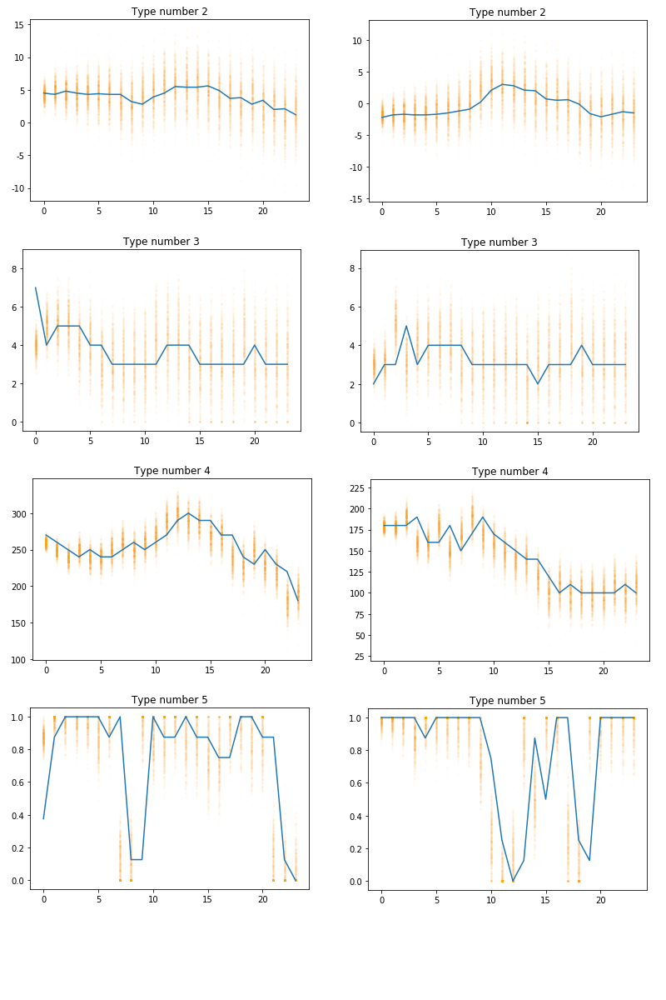

In my journey towards a powertac agent I discovered the complexity behind the weather server and thought about adapting it to make it easily deployable in a container. Once it's in a container, other teams could quickly start up an instance of their own without many dependencies (really just docker). But then I realized some oddities with the way it is set up. To generate an xml file (or alternatively serve them via REST), a `python - mysql - python - mysql - java - python` chain is set up. And to make it worse, all mysql commands are non-optimized atomic requests inside of loops in python. No bulking, no parallel processing etc.

Okay, let's think about this. We are pulling 18 years of forecast data from the servers. That's about 150k datapoints, which makes sense as we have 18 years with 24h per day. But how many points are we importing into the database?

```
START_DATE = "20090101" # YYYYMMDD of earliest report
END_DATE = "20111231" # YYYYMMDD of last report
```

so 3 years, aka 26298 datapoints. Now for each hour of these 3 years
[this script](https://github.com/powertac/powertac-weather-server/blob/master/scripts/create_forecast_data.py) generates 24 forecasts for the upcoming 24 hours. Let's do the math here:

$$ 3 \times 365 \times 24 \times 24 = 630720 $$

That's all good and well though. The problem really lies in the way the code is structured.

## Current implementation: Creating Deltas

Let's first look at the `create_forecast_deltas.py` file (with some added inline comments by me):


```
#imports ...

OUT_FILE = "deltas.txt"
MAX_ERROR = 0.0001
TOTAL = 1000000 # <-- this one. 1Mio! it's the counter of a loop later
DELTAS = [
    0.5161445829244465,
    0.4997949220914800,
    #... len(DELTAS) = 24

]
TARGETS = [
    0.5161290323,
    1.6221198157
    #... len(TARGETS) = 24
]
```


```
#main moved above for ease of top-down readability.
def main():
    errors = [0.0] * len(TARGETS)
    current = 0

    with open(OUT_FILE, 'w') as f:
        f.write("")

    #this loop gets iterated over 24 times (len(TARGETS) break below)
    while True:
        #current = 0, 1, 2, 3, ...
        error = loop(current)

        #difference between MSE and target MSE (i.e. MSE is supposed to increase over 24h predicition period)
        diff = error - TARGETS[current]
        change = 1 - max(MAX_ERROR, abs(diff) / 5)

        #next big block: comparing MSE to targets. If not fitting, iterating millions of times AGAIN.
        print current, DELTAS[current], change
        print error, TARGETS[current]
        print ("%.6f" % diff),
        if diff > MAX_ERROR:
            print "diff larger"
            DELTAS[current] = DELTAS[current] * change
        elif diff < -MAX_ERROR:
            print "diff smaller"
            DELTAS[current] = DELTAS[current] / change
        else:   
            print "diff OK"
            with open(OUT_FILE, 'a') as f:
                f.write("%d %.16f\n" % (current, DELTAS[current]))
            errors[current] = error
            current += 1

        if current >= len(TARGETS):
            break

    print
    print len(errors), len(DELTAS)
    print
    print errors
    print
    print DELTAS
```

The above block is not at all understandable to me. It seems as if the code is trying to achieve a DELTAS list that is *close* to a function resembling the derivative of the TARGETS (which are a log function) without being exact. Why this wasn't just performed by taking 24 values of a log function and adding some noise to them, I don't know.

The next function shows how a loop iterating over our `TOTAL` range (1 Mio.) and then iterating over current+1 which means 1, 2, 3, 4, 5 ... iterations for each subsequent `loop(current)` call.

$$ \sum_{i=1}^{25}{i} * 1{.}000{.}000 = 300{.}000{.}000 \text{iterations}$$

```
def loop(current):
    forecasts = []

    #1Mio times
    for _ in range(TOTAL):
        tau = 0
        temp = []
        for i in range(current+1):
            tau = tau + random.gauss(0, DELTAS[i])
            temp.append(tau)
        forecasts.append(temp)

    error = 0.0
    #mean squared error
    for forecast in forecasts:
        error += forecast[current] ** 2
    error = math.sqrt(error / len(forecasts))

    return error

```

Some sample output of the `create_forecast_deltas.py` script

```
0 0.516144582924 0.9999
0.515986943719 0.5161290323
-0.000142 diff smaller

0 0.516196202545 0.9999
0.516100208138 0.5161290323
-0.000029 diff OK

1 0.499794922091 0.999807649737
0.717932257886 0.7188940092
-0.000962 diff smaller

1 0.499891076271 0.9999
0.719294262397 0.7188940092
0.000400 diff larger

1 0.499841087164 0.999847349058
0.718130754489 0.7188940092
-0.000763 diff smaller

1 0.499917400026 0.9999
0.718902314128 0.7188940092
0.000008 diff OK

2 0.488890089098 0.99970675704
0.868349453399 0.8698156682
-0.001466 diff smaller

2 0.489033494728 0.999823374688
0.868932541638 0.8698156682
-0.000883 diff smaller

2 0.48911988568 0.999660646651
0.868118901454 0.8698156682
-0.001697 diff smaller

2 0.489285926498 0.9999
0.87002069015 0.8698156682
0.000205 diff larger

2 0.489236997906 0.999709463393
0.868362985166 0.8698156682
-0.001453 diff smaller

2 0.489379180472 0.999886141672
0.869246376561 0.8698156682
-0.000569 diff smaller

2 0.489434906712 0.999877799512
0.869204665758 0.8698156682
-0.000611 diff smaller

2 0.489494723206 0.999885588796
0.869243612179 0.8698156682
-0.000572 diff smaller

2 0.489550733295 0.999866629795
0.869148817175 0.8698156682
-0.000667 diff smaller

2 0.489616033486 0.999759522789
0.871018054255 0.8698156682
0.001202 diff larger

2 0.489498291988 0.999856598225
0.869098659324 0.8698156682
-0.000717 diff smaller

2 0.489568496979 0.9999
0.869614687695 0.8698156682
-0.000201 diff smaller
```

Overall, it seems this is all just used to generate some deltas that are close, but not on-point to the delta between each discrete step of two adjacent log function values. The purpose is that in the next script, these deltas get used to create an increasingly uncertain weather forecast for the next 24h (game horizon in powertac) without going off-the-charts. I will ask my supervisor what exactly the motivation behind those deltas is but for now, let's assume they are given (as they are in the forecast generation scripts anyways)

## Current implementation: Creating Forecast Data

This script [create_forecast_data.py](https://github.com/powertac/powertac-weather-server/blob/master/scripts/create_forecast_data.py)
works as follows (pseudo-code)

```
#[temp,speed,dir,cloud]
taus = np.zeros((4,24)) #4x24 matrix
origin = date("20090101")

while origin < end_date: #sequential

    weather = get_48h_weather() #48 sql queries in here
    taus = np.zeros((4,24))

    # make deviations
    for i in range(24):
        taus = taus[:,i-1] + np.random.normal(0, DELTAS[i],4) #shortened by me

    for i in range(24): #seq again
        weather_date = origin + hours(1)
        for j in range(24): #24^2*len(dates) seq iterations
            forecast_date = weather_date + hours(j+1)

            fc = (weather[forecast_date] + [2,1,10,0.1])*taus
            #fixing fcs to keep them in bounds (according to previous code)
            fc[1] = max(min(fc[1],19),0) #wind e [0,19]
            fc[2] = int((fc[2]) % 360)   #direction 360 deg
            fc[3] = max(min(cloud,1),0)  #cloud cover e [0,1]

            #insert into db ...

        #db commit
    origin += hours(1)
```

So this is a condensed pseudo version, but the process is the same

- iterate over all days
    - iterate over each hour
        - generate 24h of forecast data
            - insert each forecast into database


Wow. That's 630720 insert operations. No wonder, this is slow.

### Weatherbug?

The weather taus are actually reused. The forecast at 00:00 for 24:00 uses the same error as the forecast at 24:00 for 24:00+1(day). So A smart client could take the forecast for 24:00 at 00:00 and compare it with the actual values of 24:00 to then derive the taus for the 24h forecast of the next day. Any following forecast can then be error corrected and therefore is on-spot. In my eyes this is a flaw in the simulation. I contacted the team regarding this.


### Python only rewrite zip > xml

Since I just want xml in the end, I'll skip the whole DB round-trip and <!-- TODO ???--> vectorize some operations while we're at it. The basic concept could be this:

- create method for generating 24 forecasts for each timeslot i based on [i+1:i+25] items in the list
- apply method on all elements either in sequence or to really pump up the speed in parallel (or even on GPU)

The new implementation can download all data for 2000-today from the server, extract it and turn 3 years of weather reports into 3 years worth of forecast data based on the forecast generation approach in under a minute. That's a LOT better than before. Why? Well it's all in-memory and doesn't do any I/O ops. The forecasts seem alright, as the graphic below shows



All forecasts are along the lines of the actual weather but with some error up and down the spectrum, with the errors getting bigger as time progresses. This algorithm is directly taken from the previous implementation so it's not my work. But it seems to provide a decent forecast with some logarithmic error distribution.

----
## Bottom line
The new implementation can be found [on GitHub](https://github.com/pascalwhoop/powertac-weather-python-v2). It is likely though that I will rewrite most of it again. I talked to John, the "father" of powertac and he told me he's crawling most data from [aeris](https://www.aerisweather.com/) and generating a [json file](http://www.cs.umn.edu/~jcollins/weather_records.json) from it. But he also expressed interest in me taking on the weather server. It seems so as if it would be welcomed if I make aweather-server that can generate this on a regular basis. I could therefore use the [darksky.net api](https://darksky.net/dev/docs#api-request-types) and generate data by polling their API (1000x a day is free). If I poll their API on a cloud machine once every hour for say 40 cities, I can stay under 1000 requests a day and collect enough data to supply the community with solid weather simulation data. 

To be continued ...
