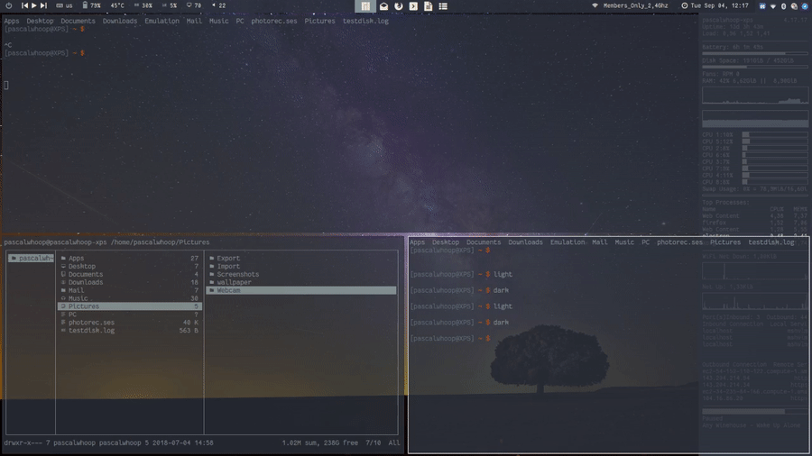
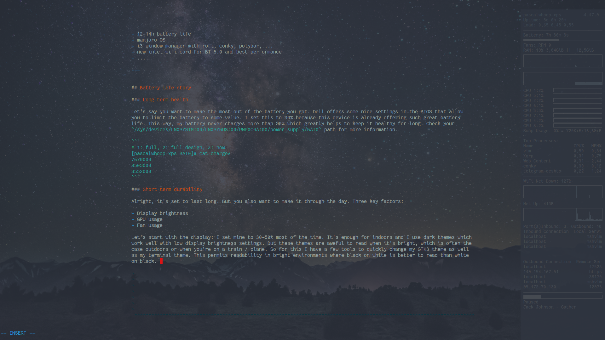
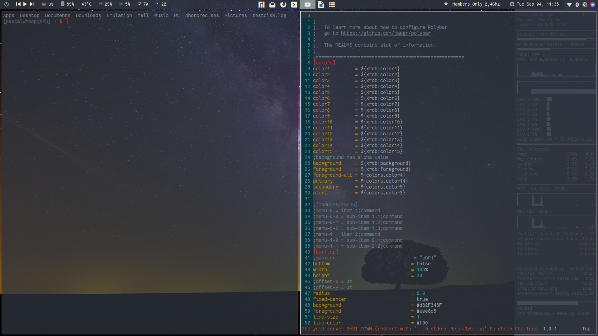
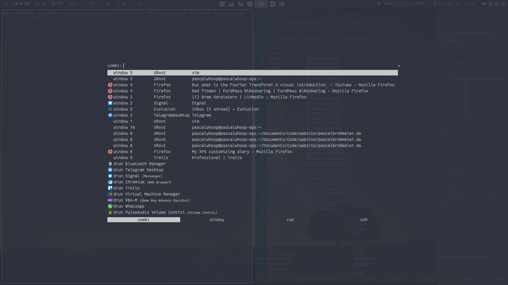
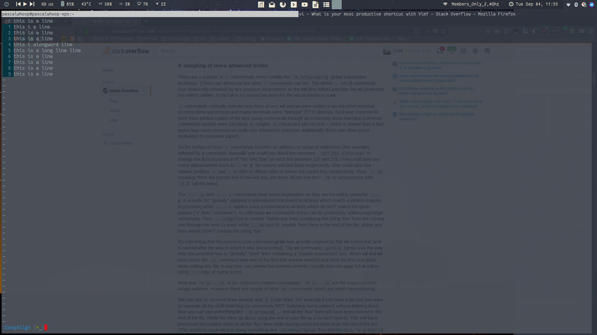
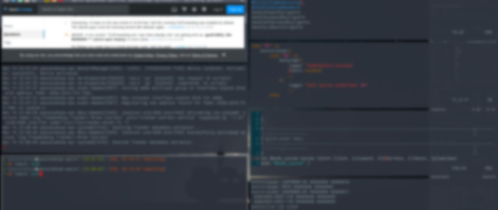

In the beginning of 2018 I started looking for a laptop that would serve as my mobile workstation. I bike a lot so there
is a weight restriction to it. After a lengthy research phase where I compared the Thinkpads, Huawei Matebooks and some
other competitors, I ended up choosing the XPS 15. It was discounted and I also made use of the student discount so I ended up
paying about 1050€ for it. It's the 16GB, 512GB SSD, i7 7700k 1080p 96Wh variant. Most importantly it is the US keyboard
layout variant. You wouldn't believe how hard it is to get a US keyboard on a laptop in the EU. 

This article serves as a summary about what I have done to make this machine my machine.

## TLDR

- 12-14h battery life
- manjaro OS 
- i3 window manager with rofi, conky, polybar, ...
- new intel wifi card for BT 5.0 and best performance
- ipad as secondary monitor via vnc and x11vnc
- ...

see video at the bottom for a lazy variant of inspiration

---


## Battery life story

### Long term health

Let's say you want to make the most out of the battery you got. Dell offers some nice settings in the BIOS that allow
you to limit the battery to some value. I set this to 90% because this device is already offering such great battery
life. This way, my battery never charges more than 90% which greatly helps to keep it healthy for long. Check your
`/sys/devices/LNXSYSTM:00/LNXSYBUS:00/PNP0C0A:00/power_supply/BAT0` path for more information.

```
# 1: full, 2: full_design, 3: now
[pascalwhoop-xps BAT0]# cat charge*
7670000
8509000
3552000
```

### Short term durability

Alright, it's configured so I will be happy for a few hundred cycles. But you also want to make it through the day. Four key factors:

- Display brightness
- GPU usage
- Fan usage
- Idle usage

#### Display brightness

Let's start with the display: I set mine to 30-50% most of the time. It's the core component to making the device last
during day to day use. These settings are enough for indoors and I use dark themes which
work well with low display brightness settings. But these themes are aweful to read when it's bright, which is often the
case outdoors or when you're on a train / plane. So for this I have a few tools to quickly change my GTK3 theme as well
as my terminal theme. This permits readability in bright environments where black on white is better to read than white
on black. 

- [dynamic colors](https://github.com/sos4nt/dynamic-colors/) let's you quickly change the urxvt themes. Good, but it
    doesn't change *all* the terminal windows.
- [this script](https://github.com/pascalwhoop/dotfiles/blob/xps/.scripts/urxvt-colors.py) changes them for all open
    terminals
- to change my entire theme, I run [this](https://github.com/pascalwhoop/dotfiles/blob/xps/.scripts/colors.sh) which
    changes the colors of the shells, makes it permanent for the current session and sets the GTK theme for GTK
    applications




Now it's OK to have the brightness low inside and also being able to quickly switch to a bright theme on the road. When
using other tools, the scripts may be extended to incorporate JetBrains tools etc to direkt them to change their themes.
I may add that in the future.

#### GPU Usage

The GPU is power hungry! Disable it with bumblebee and only use it when needed using bbswitch. See the [arch
wiki](https://wiki.archlinux.org/index.php/Dell_XPS_15_9560#Disable_discrete_GPU) for details. To make it even easier,
try the great `mhwd` tool that configures the hardware components in your manjaro distro for you. It quickly installs
bumblebee and lets you switch between open source and closed source drivers. I also installed the `cuda` and `cudnn`
packages with pacman to do some machine learning. 

```
[pascalwhoop@XPS] ~ $ nvidia-smi
NVIDIA-SMI has failed because it couldn't communicate with the NVIDIA driver. Make sure that the latest NVIDIA driver is installed and running.

[pascalwhoop@XPS] ~ $ optirun nvidia-smi
Tue Sep  4 11:10:14 2018
+-----------------------------------------------------------------------------+
| NVIDIA-SMI 396.51                 Driver Version: 396.51                    |
|-------------------------------+----------------------+----------------------+
| GPU  Name        Persistence-M| Bus-Id        Disp.A | Volatile Uncorr. ECC |
| Fan  Temp  Perf  Pwr:Usage/Cap|         Memory-Usage | GPU-Util  Compute M. |
|===============================+======================+======================|
|   0  GeForce GTX 1050    Off  | 00000000:01:00.0 Off |                  N/A |
| N/A   44C    P3    N/A /  N/A |      5MiB /  4042MiB |      0%      Default |
+-------------------------------+----------------------+----------------------+

+-----------------------------------------------------------------------------+
| Processes:                                                       GPU Memory |
|  GPU       PID   Type   Process name                             Usage      |
|=============================================================================|
|    0     25064      G   /usr/lib/Xorg                                  5MiB |
+-----------------------------------------------------------------------------+
```

As you can see, when using the `optirun` tool, your application is run using the GPU but when not using it, everything
stays on the CPU and its integrated Intel graphics. This is really neat for software development work that sometimes
uses the GPU as a co-processor for heavy parallel workloads (like NN) but otherwise has no use for it.

## (Media) keys

I am using i3. So these are my solutions to audio / lights / ... function keys.

```
#in the i3 config
#media keys
bindsym XF86AudioRaiseVolume       exec --no-startup-id pactl     set-sink-volume @DEFAULT_SINK@ +10%
bindsym XF86AudioLowerVolume       exec --no-startup-id pactl     set-sink-volume @DEFAULT_SINK@ -10%
bindsym XF86AudioMute              exec --no-startup-id pactl     set-sink-mute   @DEFAULT_SINK@ toggle
bindsym XF86AudioPlay              exec --no-startup-id playerctl play-pause
bindsym XF86AudioPrev              exec --no-startup-id playerctl previous
bindsym XF86AudioNext              exec --no-startup-id playerctl next
bindsym XF86MonBrightnessDown      exec xbacklight      -dec      5
bindsym XF86MonBrightnessUp        exec xbacklight      -inc      10
bindsym $mod+XF86MonBrightnessDown exec xbacklight      -set      1
bindsym $mod+XF86MonBrightnessUp   exec xbacklight      -set      100
```

Make sure to download `pactl` for audio control, `playerctl` for mpd and `mpdris2` for letting playerctl control manage mpd. 
It's a bit tedious to do this by hand instead of having a desktop environment take care of all of this for you. But the
upside is that you learn about D-BUS as well as how the inside components of your desktop environment work. That's
definitely a plus. Other players usually support the D-BUS signals out of the box. 

Regarding the other keys: The windows key is my i3 modifier, Caps Lock is my escape + ctrl button 

```
# Map the caps lock key to super...
setxkbmap -layout "us,de" -variant "," -option ctrl:nocaps
# But when it is pressed only once, treat it as escape.
xcape -e 'Control_L=Escape'
```

Now these keys define a set of my core shortcuts where `$mod == Win`

- `$mod+q             kill`
- `$mod+Ctrl+4        exec    teiler`
- `$mod+Shift+p       exec    passmenu`
- `$mod+Mod1+space    exec    dmenu_extended_run`
- `$mod+d             exec    rofi -show combi`
- `$mod+control+space exec    ~/.config/clipmenu/run.sh`

## Gestures

I come from a Macbook. So gestures were really nice there. I experimented quiet a bit with different drivers for the
touchpad but in the end I stuck with the following setup:

- libinput for the driver

```
Section "InputClass"
    Identifier "touchpad catchall"
    Driver "libinput"
    MatchIsTouchpad "on"
    Option "Tapping" "on"
    Option "ClickMethod" "clickfinger"
    Option "NaturalScrolling" "true"
    Option "VertTwoFingerScroll" "1"
    Option "AccelSpeed" "0.5"
EndSection
```

and libinput-gestures as the gesture tool

```
# Move to prev workspace (works for GNOME/KDE/etc on Wayland and Xorg)
gesture swipe down  _internal ws_down
# gesture swipe down    xdotool key super+Page_Up

# Browser go forward (works only for Xorg, and Xwayland clients)
gesture swipe left 3    xdotool key "ctrl+35"
gesture swipe left 4    i3 workspace next

# Browser go back (works only for Xorg, and Xwayland clients)
gesture swipe right 3   xdotool key "ctrl+34"
gesture swipe right 4   i3 workspace prev
gesture swipe up 4 xdotool key "Super_L+f"
gesture swipe down 4 xdotool key "Super_L+f"
```

These gestures allow me to switch between the i3 spaces and also let me use the three finger forward/backward in the
browser for navigation. The latter is most important to me as browsing really involves a lot of touchpad usage. 

## Virtual machines

I experimented with VMWare Player and VirtualBox in the past but then got a recommendation to try `libvirt` and
`virt-manager` which I then installed and configured as described in the
[wiki](https://wiki.archlinux.org/index.php/Libvirt). 

This lets me start and stop my VM's using commands in my i3 config, similar to my other starting scripts. I haven't
mapped anything yet because I almost never use a VM on my laptop but it is nice to know that I can map it to a quick
keyboard shortcut instead of opening an application and then clicking around. Also, this let's me always start my VM on
full-screen in space 6 (my VM space) and it's also interesting to learn the open source components of the Linux VM
landscape. 

## UI Customizations

i3 by default is rather ugly (*personal opinion). So I used 
- `i3-gaps` to make it look a bit more sleek 
- `polybar` instead of the `i3-bar` for media, system stats, spaces indicators and tray icons. 
- `rofi` as a `dmenu` replacement for a number of tools such as
    - `clipmenu` for a clipboard history that synchronizes across my machines via `syncthing`
    - `rofi` itself to start applications and jump to running windows between spaces
    - `dmenu-extended` using the rofi interface to search my files (based on the `mlocate` tool)
- `Arc-Dark` GTK theme to style everything in a nice and uniform way
    - adapting the `conky` bar on my right side and the `polybar` themes to use the same colors as Arc-Dark
- a [custom script](https://github.com/pascalwhoop/dotfiles/blob/xps/.scripts/colors.sh) to switch between  *dark* and *light* environments
    - switches between Arc-Dark and Arc-Light, including all terminals and GTK applications (after a restart of the gtk
        apps)

So, this is the result of all of this:

A *distraction free* writing environment using `Goyo` in vim combined with a full-screen terminal and some transparency
settings using `compton`.



A 2 side split pane for two side by side applications



Using rofi to switch between open windows or open new applications



My favorite: transparent terminals help to work with a small screen when looking up something on stackoverflow and
typing it into the terminal afterwards



## Locking on lid close or button press

I want my laptop to lock the screen and suspend to RAM when closing the lid. I also like to just hit the power button to
lock the device quickly in case I walk away. For this, I had to first disable `systemd` handling of the ACPI events and
then activate and configure `acpid` under `/etc/acpid/handler.sh`. So first I disabled systemd as [described
here](https://unix.stackexchange.com/a/52645). Then I set my `handler.sh` to call `i3lock -c 222222` on pressing my
power button and `i3exit suspend` when closing the lid. I know that this is a little unintelligent because it links my
acpi event to my WM. But I am happy with it for now. I could alternatively rely on `slock` and call `systemctl suspend`
but I like the look of the blurred i3exit. 



## Others

- [My dotfiles](https://github.com/pascalwhoop/dotfiles/tree/xps) host most of my configs. 
- [syncthing](https://hub.docker.com/r/linuxserver/syncthing/) in a docker container takes care of syncing files between
    my devices without touching a cloud. It uses SSL encrypted  P2P torrent protocols to synchronize between devices and
    directly synchronizes between them if they are in the same network 
- using my iPad as a secondary monitor using a VNC app as well as [these scripts](https://github.com/pascalwhoop/dotfiles/commit/52be449469f91bfa6a76b94f5fbe223ff665bcb8)
- purchasing the intel 9260 wifi card and replacing the killer wifi card. I only noticed issues with one wifi network
    but didn't want to risk it. Plus, BT5.0 right?


## Video


