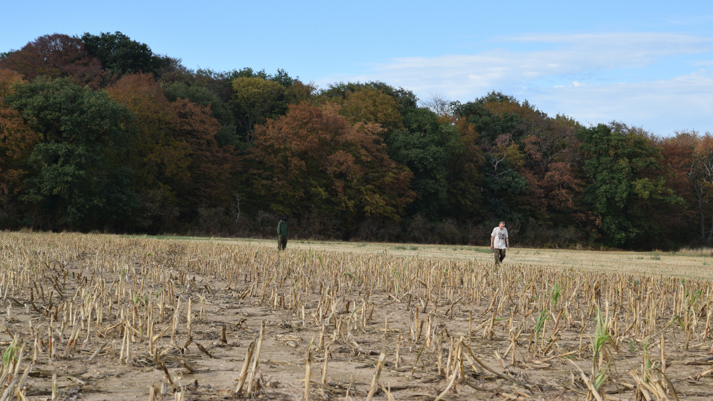
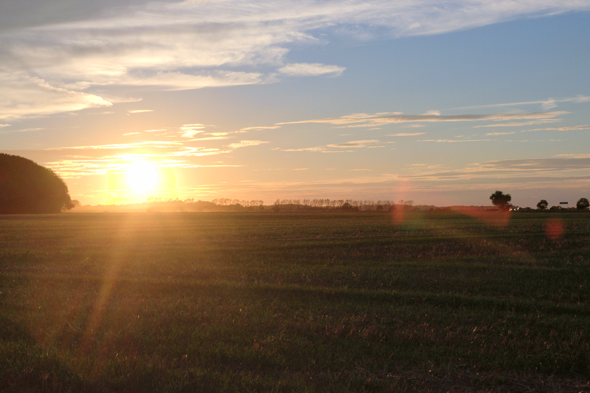
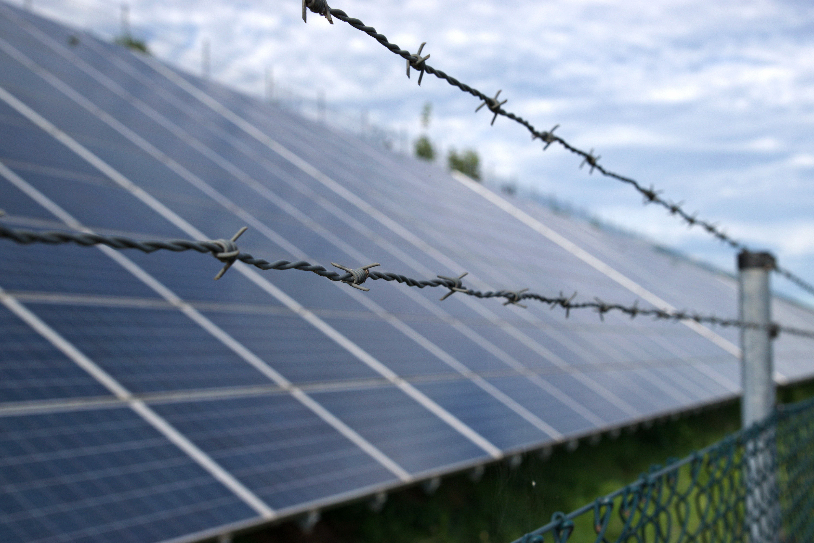

Yesterday I visited the demonstrations against RWEs large lignite (aka brown coal) factory and their plans to cut down
the last parts of a formerly huge forest. It's close to my home and I decided to see for myself what so many people are
so passionate about. This is my report of my observed behavior, my talks to people and the conclusions I drew from the
day. If you just want to look at some nice pics, check the bottom.

## Context

A quick summary for those that don't live here or know much about coal mining:
[Lignite](https://en.wikipedia.org/wiki/Lignite) is a low rank fossil fuel energy source that is [most widely
used](https://en.wikipedia.org/wiki/Lignite#Production) in Germany. RWE, one of the large energy providers here runs
several large surface mines to retrieve the lignite. They cover a surface area of about the same surface as the
metropolitan area of Cologne. Standing on the edge of these giant holes is severely impressive. Aside from the obvious
issues of fossil fuels, the reasons for the demonstrations are the fact that surface mines need to destroy large surface
areas to retrieve the underlying fuel. This includes removing entire villages, forcing people out of their homes as well
as clearing forests and thereby destroying large CO2 capturing vegetation. 

On the other hand, modern society needs a consistent energy source and while renewable energy is discussed as the future
of energy, it cannot provide when outside conditions (such as solar intensity, wind speeds and water throughput) are not
sufficient. A [great article](https://www.sciencedirect.com/science/article/pii/S2542435118303866?via%3Dihub) (Sepulveda
et.al.) clearly lists the interaction and requirement of all three types of energy infrastructure that is required to
reach low-carbon energy grids. *Firm* resources such as coal, gas or nuclear energy are required to complement sporadic,
volatile renewable sources and storage or curtailment technologies.

The demonstration is about a small patch of forest, hardly a relevant amount of forest when considering the amounts that
we need to save. But it serves as a signal. A forest on the edge of the coal mine, trees that are to be removed to make
space for machines and coal. That is why activists have defended and sometimes even lived in this forest for several
years now. Technically owned by RWE, there are patches of land that are owned by others and a small, semi-permanent camp
has been created there that supports this demonstration. Within the next weeks, it will have to be decided which side
gets their way.

## Positions and Observations

During Sunday, I talked to a few people to hear about their experiences and learn about what is going on. I asked the
organizer of the demonstration (organized by "grüne Jugend") about a case where an activist has been sentenced to jail
for several months [see tag #freeUPIII](https://twitter.com/search?q=%23freeupiii&src=typd). Unfortunately, not much
was told about this. It appears that this activist must have done *something* wrong but the way she is detained seems
peculiar. Especially for a person that cannot speak German, it must be troubling to be detained and put into prison
without having contact to the outside world. On the other hand I still want to believe that a police force will not just
take someone and throw them into prison for no reason. 

I let myself fall back and started talking to the police. I was told they saw attacks with Molotov cocktails and stones
in the past weeks. I assume these attacks must be reported somewhere, especially since the police carries large cameras
on sticks during such activities. It would be interesting to see such photographic proof, at least as long as we can
still rely on such proof, since [AI may take that away again soon](https://www.youtube.com/watch?v=GRQuRcpf5Gc).
Generally, they spoke about a lot of "violence, originating in the forest" but pointed out the very peaceful climate on
Sunday. There was no comment on the burned bus that was holding materials for the activists which was parked in Buir
which was most likely burned down by someone, unless it (ironically a former fire-truck) suffered spontaneous
self-combustion. An investigation is pending.

Something else I noticed: when the procession reached the camp on the outskirts of the forest, one face-mask wearing
resident of the camp apparently came too close to the demonstration and the police followed him for a little while. I
guess, when wearing face masks during a demonstration, you walk a fine line ([link to
law](https://dejure.org/gesetze/VersG/17a.html)). Once he moved away, they let him go. Another figure has been standing
on the outskirts of the demonstration, watching the whole process from far away. 

The official part was over and therefore the police left. I took my bike and walked towards the camp, assuming that
while I don't look *like one of them* I also don't have to worry to be mistaken with a police officer. The mood in the
camp was quiet and peaceful, people cleaned their dogs fur and talked about organizing water and electricity. I saw a
sign that complained about someone who spent a night in the "info-point", because that person apparently didn't behave
and left everything in a mess. The clay based self-built houses and old camper vans made a cute street of random
buildings. I definitely respect the creativity and ability to whip up a local power grid with a few solar panels and a
small wind mill. There seemed to be no water supply however. I noticed the people there weren't quiet as talkative as
the police officers which was curious to me. I guess I overdid the whole *look like a business student* approach, which
was supposed to get me past any potential filter points that I read about the previous days. The overall vibe was
definitely that of a lingering conflict that is all about tactics, making the right moves and collecting information. I
took my bike through the actual forest which was covered with small pieces of wood and some larger structures such as a
few meter high tripods. Nothing that would actually keep RWE from taking the forest apart of course, but I guess it was
the thought that counts.

Taking the bike out of the forest after a while, I aimed towards the large machinery at the horizon. From a technical
perspective, these machines are fascinating to me and I wanted to get a better look. I saw a police van on the top of
the hill and figured they'd be nice and friendly, as we are not in the US and I haven't attacked anyone. I arrived and
the mood was in fact nice and friendly, although they assumed I was "from the camp" as I later overheard the leading
officer mumble to a pair of undercover patrols that stopped by. In that moment I corrected him and realized that I
wanted to be neither associated with the people in the camp nor with the company. I was an observer and apparently that
was important enough to me that I spoke up right away. He noted that he just wanted to ensure that the colleagues don't
spill any internal information while I am around. That of course is a clear signal that there is a form of tactical
forth and back going on. The police have plans that are best kept secret and so do the camp inhabitants. 

Finally, I took my bike back around the forest and headed towards Buir. Just before the city, I stopped at the
Greenpeace truck and talked to some people there. It seemed that everyone is aware of the complexity of this problem:
kill coal and atomic energy and you loose a solid network. of this problem: kill coal and atomic energy and you loose a
solid network. of this problem: kill coal and atomic energy and you loose a solid network. of this problem: kill coal
and atomic energy and you loose a solid network. of this problem: 
- kill coal and atomic energy and you loose the stability in the network
- kill too many trees and you loose all the CO2 regulating nature
- build too many Lithium batteries to store energy and you kill the climate through the up-front costs
- electric cars may make the problem better (as storage utilities) or worse (through more electricity demand)
- solutions cannot come from simply one of the three components (cultural change, tech and regulation/market design) but
    through a combination
- questionable police actions
- extremists within the ranks of the activists 
- political lethargy 
- lobby influence
- ...

It was a nice talk and although we just kept uncovering more and more reasons for why the problem is complex, I wish
such talks, also between both opposing fronts, were more common. 

## Conclusion

If there is any conclusion to draw it is that there are a large number of problems at play. As a mathematician, one may
say there is no global optima. If thousands of stakeholders all weigh there criteria in different ways, how is one to
derive a solution that satisfies everyone without triggering anyone to feel so unfairly treated that they are willing to
trigger violence. Some see themselves as the guardians of nature while others see themselves as the hated few that make
everyone's coffee maker work in the morning. Narratives that we tell ourselves to justify why we do the things we do I
guess. I believe these situations are very intense for a lot of people, including the police and many activists and RWE
employees but that doesn't mean they are warranted. If the game was designed in a way that lignite wasn't economically
feasible anymore, it wouldn't be mined anymore. So shouldn't the most effective lever really be in the area of policy
design and market design? I believe we need elegant market designs that make market participants *want* to save energy,
use it intelligently, produce it sustainably and be fine some compromises. Me personally, I will dig deeper into the
research of how the markets work and figure out what wrong incentives might be given to corporations like RWE that cause
them to behave in such a crude fashion of just uprooting whatever is in the way to dig up some more of this really dirty
energy source. 

As a final image, I found the solar panels on the outskirts of Buir fascinating. About a kilometer of large packs of
solar panels, all angled towards the sun. Ironically, the same company that digs up all this coal is the one that places
the panels all over the hills. But its again theirs, and if solar panels end up being an evil technology, they surely
would defend them just as they defend the coal today. 

