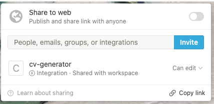

I wanted to generate a CV automatically from my notes that I take on every project I have
been on for a while now. For these notes, I use [notion.so](notion.so) so I thought I'd
tap into their API to generate my CV automatically from this data. 

The goal is to generate a CV from my notes, leveraging
[jsonresume](https://jsonresume.org/) as well as the data in notion and some python code
to bring it together.

# Extracting the data from the notion API

First we have to create an extension in notion and share the database with the extension. This allows us to read the data from this database into python. 



```python
```