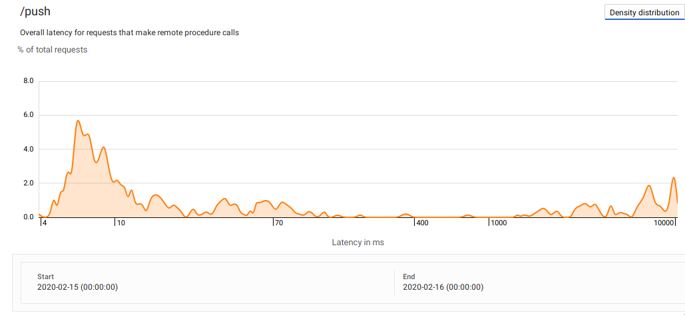

When talking to clients, the topic of message ordering came up a few times when talking
about GCP Pub/Sub. When looking at the architecture, it becomes clear, Pub/Sub *can*
have ordering issues, since it contains N publishing forwarders and M subscribing
forwarders, depending on the ingress and egress load. But that doesn't mean that
messages will *always* be out of order. Many customers have messages come in at a rate
of say 1 msg per second. Will it be out of order then? Or maybe at a rate of 10 msg/sec?
Or 50? Of course this depends on many factors (such as message size and sender count /
geographical location). But assuming we have 1 sender and 1 receiver, when will PubSub
start showing out of order messages? 


To me, this sounds like a perfect question to run a little experiment

## Experimental setup


The high level concept is this:
1. Every 2 hours, a cloud scheduler event triggers a cloud function
2. the function sends messages to pubsub for 10 minutes sequentially with a pause
   interval of `[1sec;1/2th sec; 1/10th sec;... 1/100 sec]` 
   - each message contains a continuous counter
   - a total of about 300k messages are sent in under 10 minutes
3. Pub Sub push forwards these messages to an AppEngine deployment
4. AppEngine keeps track  of the messages coming in and compares the previous message
   counter and the current messages' counter. If it isn't continuous, it logs an
   out-of-order message. If the message isn't in "it's right place" (meaning message
   with counter 100 is the 100th message received), an out-of-index is logged.
5. Because AppEngine is stateless, all results are stored in a basic memorystore instance


## Code

All code is available on [Github](https://github.com/pascalwhoop/pubsub-order-test). 

To set up the infrastructure, I used `terraform`. To deploy the AppEngine code as well as the
cloud function code I use the `archive_file` provider in terraform together with uploading the
source code to Google Cloud Storage as a zip file. Versioning of the applications is handled by
GCP. Unfortunately, [the google provider doesn't
support](https://github.com/terraform-providers/terraform-provider-google/issues/4988)
the `vpc_access_connector` property required to get AppEngine to connect to Memory
store. So that one has to be manually deployed with `gcloud` despite terraform being
able to handle the deployment for me. 

All files are shown below. It's actually not much. The infra folder is artificially
blown up due to what I'm used to from projects at clients. Most files contain only 1-2
resource definitions. 

```bash
$ tree -L 2 ./
./
├── generator
│   ├── main.py
│   ├── requirements.txt
│   ├── script
│   └── test_main.py
├── infra
│   ├── account.json
│   ├── apis
│   ├── appengine.tf
│   ├── bucket.tf
│   ├── function.tf
│   ├── provider.tf
│   ├── pubsub.tf
│   ├── redis.tf
│   ├── scheduler.tf
│   ├── script
│   └── variables.tf
├── reader
│   ├── app.yaml
│   ├── main.py
│   ├── requirements.txt
│   ├── script
│   ├── test_main.py
│   └── test_request.json
└── README.md

```

Sidenote: GCP requires each API to be enabled before you can create resources. I created
an API module but it's best to have a separate TF project for this. This could be called
the "bootstrapping" project, which is run under org admin priviliges and creates the
target project as well as all APIs needed for the given project. It could then also
create the key for the service account that can be used by the project specific
terraform setup. Ideally, that service account is stored in a secrets store and
terraform apply is only executed through CICD. 

### Sender

Below is the core routine of the sender. 

```python
counter = 1
print(f"stage {stage}, sending message every 1/{nth} second")
finish_time = datetime.now() + duration
while datetime.now() < finish_time:
    _send(publisher, _make_message(stage, nth, counter))
    counter += 1
    time.sleep(1 / nth)
```


the hour mappings are 
```python
hour_mapping = { 
    0: 0.5,
    1: 1,
    2: 2,
    3: 10, 
    4: 50, 
    5: 100,
}
```
meaning that stage 0 sends 1 msg every 2 seconds, stage 3 10 msg/sec and stage 5 100msg/sec.

### Receiver

The core flow of the receiver is to simply keep a tally of the out of order and out of
index messages. Because AppEngine doesn't keep state reliably, I use Cloud Memory Store
(Redis) to keep state. I set the AppEngine auto-scaling to manual and 1 instance to
avoid out-of-order errors due to my own infrastructure. The downside here is that a
single AppEngine instance probably cannot handle HTTP requests as quickly as PubSub can
send them. 



```python
#r == redis instance
db_total = r.incr  (total_key.format(id))
db_last  = r.getset(last_key.format(id), msg_counter)

if db_last is None:
    #first message -> skip
    _log_hist(id)
    return
db_last = int(db_last)

if  db_last +1 == msg_counter and db_total == msg_counter:
    _log_hist(id)

# not same number as what we received so far
if msg_counter != db_total:
    r.incr(ooi_key.format(id))

# previous message was not -1 of current
if db_last +1 != msg_counter:
    r.incr(ooo_key.format(id))
    _log_hist(id, "O")

```

## Results


Because analyzing the results through logging outputs can be a bit annoying (and more
importantly because I'm not currently in the mod of making fancy visuals), I made use of
a simple string to quickly visualize out of order events. So for an example of a 1/50th
sec message flow, the following results can be observed:

<!--
https://en.wikipedia.org/wiki/Poisson_distribution
--> 
```json
  "20200217-12:0.hist": ".........................................................................................................................................................................................................................................................",
  "20200217-12:0.last": "249",
  "20200217-12:0.total": "249",
  "20200217-13:1.hist": "...............................................................................................................................................................................................................................................................................................................................................................................................................................................................................................................",
  "20200217-13:1.last": "495",
  "20200217-13:1.total": "495",
  "20200217-14:2.hist": ".OOO............................................................................................................................................................................................................................................................................................................................................................................................................................................................................................................................................................................................................................................................................................................................................................................................................................................................................................................................................................................................................",
  "20200217-14:2.last": "976",
  "20200217-14:2.ooo": "3",
  "20200217-14:2.total": "976",
  "20200217-15:3.hist": ".OOOOOOOOOOOOIOOO................OOO...................................................................................................................................................................................................................................................................................................................................................................................................................................................................................................................................................................................................................................................................................................................................................................................................................................................................................................................................................................................................................................................................................................OOO.OOO......OOO..OOO......................................................................................OOOOOOOO........................................................................................................................................................................................................................................................................................................................................................................................................................................................................................................................................................................................................................................................................................................................................................................................................................................................................................................................................................................................................................................................................................................................OIIIOO..........OIOO..........................................................................................OOOOIIIOOOOOOOO..........................................................................................................................................................................................................................................................................................................................................................................................................................................................................................................................................................................................................................................................................................................................................................................................................................................................................................................................................................................................................................................................................................................OOO............OIOO..........................................................................................OOOOOOOO.OOO..OOO...................................................................................................................................................................................................................................................................................................................................................................................................................................................................................................................................................................................................................................................................................................................................................................................................................................................................................................................................................................................................................................................................................................................OIOO...............................................................................................OOOOOOI..OIOO.................................................................................................................................",
  "20200217-15:3.last": "4923",
  "20200217-15:3.ooi": "12",
  "20200217-15:3.ooo": "88",
  "20200217-15:3.total": "4923",
  "20200217-16:4.hist": ".IOOOOIOOOOOOOOOOOOOO.......II................OOO.........................OOO..OOO....................................................OOO..............OIOOOOO.......OOO...........II...........OOO.....OOO...............OIOOOO.........................................II.OOOO.........II....OOOO..OOOOO.........OOO..........OOO.OOO...............OOO...........................II.......OOO.....................OOO....OOO..............................OOO.........OOO................II......................II.............II.....OOO.............................II.........OOO...OIOO.........OOO...........OOOOOO...OOOOOO..............OOO..OOO.....................OOO............OOO.OOO...OOO...OOO.....................II..OOO.................II..........OOO...................................IOIIOO....OOO...........OIOO....OOO.........OOO..........OOO.......OOO..........................................................OOO....OOO...............OOO......II....II.......II..................II.....II..........OOO.............OOO.......OOO...............II.OOO...OOO...........................................II........OOO..........................................II..OOO...................OO.O........OOO.................................................................................................OOO...........................................OOO...OOO......OOO...............................................OOO...............OOO.......................OOO....OOO.......................................OOO..........................OOO...............OOO....II..........II.OOO.II....OOOO..................OOO............II................II...............II................OOO.........................OOO...................................................OOO......OOO............................................II....OOO.......OOO............OOIO.........................................OOO....II...........................OOO.........II.............II.....II...........OOO..........OOO........................................II............................II.........................I.I.............OOO.........OOO.......................................................OOOOIIIIIIIIOO...........OOO................................OOOO.........................OOO.OOOOOO...OOO..OOOII........OOO.........OOOO.OOOO........OOO......OOO........OOOOO...OOOOOO.......OOOOOOOO.......OIOO.OOO....OOO..............OOO.............OOO...................................................OOO..........OOO......OOO.......OOO..........OOO.............II...............OOO......OOO.........II........................................................................OOOII..OOO......OOO......OOO.....OOOOO.....................OOO....II..........................OIOO.....OOO....OOO.II.................OOO................................................OOOII.................................................................II.OOO..............OOO.......................OOO.........OOO......OOO.....OOO.......OOO...............................OOO.OOO...................OOO...OOO.....................................................IOOO.........OOO.................OOO..............OOO.......................................................................................OOO........OOOOO.......................................OOO...OO.O.....OOOOIIIIOOIOOOIIOO.........................II..................OOO......OOO.....OOO.............OOO......................OOO.....................OOO.......OOO..........II...........OOO..................OIOIOIIII.OO.....II..........................OOO................................OOO..........OOO...OIOO.....OOO.......................OIOO....OOO.OOO..................OOO...........................OOO...........OOO......OOO........OOO.............OOO........II......................OOO..........OOO.....II........................II...................OOIO..II.................OOO...................................OOO.............II.....II...........................OOO..........................................................................OOOOOO.................OOO...OOO......OIIOO........OOO.................OIOO...............................................II.....OOO............II......OOO.................OOOOIO.........II...........OOOOOOO...II......II.......................................OOO........OOOIOO..............OOIOOO.....OOOOOIOO..................II................II..............II.OOO.........II..............OOO.............OOO..........................OOO....................OOO............OOIO........OOO...........................................OOO.OOO...........................OOO..........................OOO.................OOO.OOO.OOO............OOO...OOO................OOO..............................OOO......................OOO.........OOO..........................OOOO........OOO...OOO.......OOO.............................................OOO...............OOOOIO............................OOO......OOO................OOO.OOO...........................................................OIOO............OOO.........OOO........OOO......................OOO.........OOO....OOO......................................OOO......OOO.OOIO....OOOOOO.....................OOO...............................OOO..........OOO.OOO......II..........OOO......II...................................................OOOOOO......................OOO.....................................................OOOIO....OOO....OOO...................OOO....OIIIIOOOO..........OOO..................OIIIOOOIIIIIIIOO........................OOO........OOO....OOO......OOO...............II...........................OOO...................OOO.....................OOO......OOO.......OOO..................OOO.OOO...OOO......OOOII......................................OIOO.........................................OOO.OOO..OO..O...............OOO....OOO...OOO...............OOO...........II......OOO.....................OOO...........................OOOIOIOO...........................OOIO..............OOO...................OOOOO.....................................OOIOO..........IIOOO..............................................................................OIOO.......................................OOO....OOOOOOO.......OOO................OIOOOIIOO....OOO......OOOO.....OOOOOO.....OOO..................OOO....OOO........................................OOO............OOO....IIOOO.....................OOO...........................OOOOOO.....................OOO.........OOO....OOO.........II....OOO............OOO.II........OOO..OIOO..........OOO......................................OOO......................OOO....OIOIO...................................OOO.............................II..........II.............................OOO...........OOIO.............OO.O.......I.I...........OOO..........OOO.OIIOO........OOO..........OOO......II.OIIIOO....OOO..........OOOIOOO...............OOO.........................OOO.........................................OIIIOIOOO................OOOO..........OOO.........II......................OOO........................................OOO..OIOO.....OOO.II..OOO.....OOO............II........................OOOOOOII.........................................OOOOOO.........II........................II...OOOOOO...................................OOO...OOO.......OOO......OOO.........II..OOO..OOO......II......................OOO.......OOO...OOO...............II....................OOO.OOO..............................................IOOO.............OOO.................OOOOOOO.............OOO............OIO.O...........OIIIOO........OIOIOO.O..........OOO.......II.OOOO.OOO.............OOO.................OOOII.............OOO.....IOOO.........OIOOOOO..........OOO...OOO...........................OOO..........................................II.....................II...OIIIOOOOOOOOOO..........OOO......OOO.............OOO.....OOOOOOOIOOOO............OOOOO....................................................................................OOO.......OOO.....................OOO...IOOO..........................OOO........OOO....................................OOO...........OOO..................OOO....................OOO............II....OOOIOOO.........................................OOO......OOOOOO.....................OOO...............OOO...............OIOO..........IOOO...........II..........OOO.OOO.....II............OOO.........................OOO..OIOOOOOO.......OOO.OOO..................OOO.................OOO.................OOO......................II..........OOO..........IOOO...OOO......................OOO......OOO......II.......III........................OIOO.......................OOO.....OOO.II......................................OIOOIOIIOOOO......OIOO.O....OOO........................................OOO................OOO.....OOO............................OOO.........OIOO....OOO....................................OOO.........OOIO....OIOOO....OOO.............OOO....................III..........O.OO............................................................OOO..............................OOOO.OOO..............II...................OOOOOO........II.............................OOO............................................OOO...OOO....OOO..............OOO...............OOO......................II....................................OOIO.O............OOO..........OOO............II....OIOO...........OOO............................OOO..................OOO.......OOO......................OOO........II............OOO.......OOO................OOO.....II.......OOO........II.....OOO.......OOO.OO.O................OOO.OOO........................OOOO......II..OOO............................OOO.....II.....II...................II.......OOOOOO........................................OOIO..................OIOO..........OOO......OO..O.........II..........................OOO.......OOOOOO.....II.............OOO..............OOO.......OOO............................OOO........OOO............OOIIIIIIIIIIIOOOIOOOIIIOOOIIIOOOIIIIIIIIIII.IIIIIIIIIIIIIOOOIIIIIIIIIIIIIOOOIOOOIIIIIIIOOOOIIIIIIOOOIIIIIIIIIIIIIIIIIIIIIOOOIOOOIIIIIIIIII.IIIIIIIIIIIIIIIIIIIIIIIIIIIIIIIIIIIIIIIIIIIIIIIIIIIIIIIIIII.IIOOOIIIIIIIIIOOOIIIIIIIIIIIIIIIIIIIIIIIIIOOOOOIOOOOOOOOIIIIIIIIIOOOIIIIIIIIIIIIIIOOOIIIIOOOOOOOIIIIIIIIIIIIIIIIIIIIIIIIIIIIII.IIIIIIIIIIIIIIIIIIIIIOOOIIIIIIIIIIIIIIIIIIIIIIIOOOIIIIIIIOOOIIIIIIIIIIOOOIIIIIIIOOOIIOOOIIIIIIIIIIIIIIIIIIIIIIIIIIIIIIIIIIIIIIIIIIIIIIIIIIIOOOIIIIOOOIIIIIIIIIOOOIIIIIIIIIIIIIIIIIIIIIIIIIIIIIIIIIIIIIIIIIIIIIIIIOOOIOOOIIIOOOOIIIIIIIIOOOIIIIIIIIIIIIIIIIIIIIIIIIIIIIIIIIIIIIIIIIIIIIIIIOOOOIIIIIIIIIIIIIIIIIIIIIIIIIIIIIIIIIIIIIIIIIIIIIIIIIII.IIIIIIIIIIIIIIIIIIIIOOOIIIIIIIIIOOOIOOOIIIIIIIIIOOOIIIIIIIIIOIOOOIII.IIIIIIIIIII.IIIIIIIIOOOIIIIIIIIIIIIIIIIIIOOOIIIIIIIIIIIOOOIIIIIIIIIIIIIIIIOOOIIIIIIIIIIIIIIOOOIIIIIIIIIIIIIIIIOOOOOIIIIIIIIIIIIIIIIIIIIIIIIIIOOOOIII.IIIIIIIIIIIIIIIIIIIIIIIIIIIIIIIIIIIOOOIIIIIIIOOOIIIIIIIIIIIIIIIIOOOIII.IIIIIIIIIIIIIIIIIIIIIIIOOOIIIIIIIIOOOIIIIIIIIIIIIIIIIIIIIIIIIIIIIIIIIIIIIIIIIIIIIIIII.IIIIIOOOOOOIIIIIIIIIIIIIIIIIIIIIIIIII.IIIIIIIOOOIIIIIIIIIIIIIIOOOO.OOIIIIOOOI.IIIIIIIIIIIIIOOOO..OOIOOOIIIIIOOOOOOOOIIIIIIIIIIIIIIIIIIIIIIIIIIIIIIIOOOIIIIIIIIIIIIIIIIIIIIIIIIIIIIIIIIIIIIIIIIIIIIIIIIIIIIIIIIIIIIIIOOOIIIIIIIIIIOOIOIIIIIIIIIIIIIIIIIIIIIOOOIIIIIIIIIIIIIIIIIIIIIIIIIIIIIIIIIIIIIIIIIIIIOOOIIIIIIIIIIOOOOOOOOIIIIIIIIIIIIIIIIIIIIIIIIIOOOIIIIIOOOO.OOIIIIIIIIIO..II.IO.OIIIIIIIIIIIIIIIIIIIIIIIIIIIIIIIIIIIIIIIIIIIIOOOIIIIIIIIIIIIIIIIIIIIIIIIIIIIIIIIIIIIIIIIIIIIOOOIIIOOOIIIIIIIIIIII.OOOIIIIII.IOOOOOOOIIIIIIIIIIIIIIIIIOOOIIII.IIIIOOIOIIOOOOOIOOOIIIIIIIIIII.IIIIIIIIIIIIIIIIIIIIIIIIIOOOOIIIIIIIIIIIIIIIIIIIIIIIIIIIIIIIIIIIIIIIIIIIIIIIIIIIIIIIOOOIIIIIIIIOOOIIIIIIIIIIIIIIIIIIOOOIIIIIIIIIIIIIIOOOIIIIIIIIIIIIIOOOIIIIOOOOOIIIIIIIIIIIIIIIIIIIIIIIIIIIIIOOOIIIIIIIIII.IIIOOOIIIIIIIIIIIIIIIIIIOOOIIIIIIII.IIIIIIIIIOOOIOOOOOOOI.IIIIIIIIIOOOIIIIIIIIIIIOOOIIIOOOIIIIIIIIIIIIIIIIIOOOIIIIIIIIIIIIIIIIIIIIIIIIIIIIIIIIIIIIIIIIIIIIIIOOOIIIIIIIIIIIIIIIIIIIIIIIIIIIIOOO..OOOOIIIIIIIIIIIIIIIIIIIIOOOOIIIIIIIIIIIIIIIIIIOOOIIIIIIIIIIIOOOIIIII.OOOIIIIIIIIIIIIIIIIOOOIOOOIIIIIIIIIIIIIIIIIIIIIIIIIIO..OOIIIIIIIIIIIIIIIIIIIIIIIIIIIIIIIIIIIIIIIIOOOOOOIIIIIIIIII.IIIIIIIIIIIIIIIOOOIIIIOOOIIIOOOIIIIIIIIIIIIIIIIIIIIIIIIIOOOIIIIIIIIIIIIIIIIIIIIIIIIIIIIIIO...OOIIIIOOOIIIIIOOOOIIIIIIIIIIIIIIIIIIIIIIIIIIIIIIIIIIIIIIIIIIIIIIIIIIIOOOIIIIIIIIIIIIIIIIIIIIIIIIIIIIIIIIIIIIIIIIIIIIIIIOOOIIIOOOIOOOIIIIIIIIIIIIIIIIOOIOIIIIIIIIIIIIIIIIIIIIIIIIIOOOIOOOIIIOOOIIIII.IIIIIIIIIIIIII.IIIIIIIIIIIIIIIIIIIIIIIIIIIIIIIIIIIIIIIIIIIOOOIIIIIIIIIIIIIIIIIIIIIIIIIOOOIIIIIIIIII.IIIIIIIIIIIIIIIIIIIIIIIIIIIIIIIIIIIII.IIIIIIIIIIIIIIIIIIIIIIIIIIOOOIIIIIIIIIIIIIIIIIIIIIIIIIO....OOIIIIIIIIIIIIIIIIIIIIIIIIIIIIIIIOOOIIIIIIIIIIIIIIIIOOOIIIIIIIIIIIIIIIIIIIOOOIIIIIIIIII.OOOIIIIIIOOOIIIIIIIIIIIIIIIIIIIIIIIIIIIIIIIIIIIIIIIIIIIIIIIIIIIIIIOOOIIIIIIIIIIIIIIIIIIIIIIIIIIOOO.....OOIIIIIIIIIIIIIIIIIIIIIIIIIIIIIIIIIIIIIIIIIIOOOIIIIIIOOOI.IIIIIIIIIIIIIIIIIIIIIIIIIIIIIIIIIIIIIOOOIIIIIIIIIIIIIIIIIIIIOOOIIIIIIIIIOOOIIIIIIIIIIIIIIIIIIIIIIIIIIIIIIOOOIIOOOIIIIOOOIIIIIIIIIIIIOOOIIIIIIIIIIIIIIIIIIIIIII.IIIIIIIIOOOIIOOOIIIIIIIIIIIIIIIIIIIIIIIIIIIIIIIOOOIIIIIIIIIIIIIIIIIIIOOOO..OOIIIIIIIIIOOIOIIIIIIIIIIIIIIIIIIIIIIIIIIIIIIIIIIIIIIII.IIIOOOIIIOOOII.IIIIIIIOOOOOOIIIIIIIIIIIIOOOIIIIIIIIIIIIIIIIIIIIIIIIIIIIIIIIIIIIIIIIIIIIIIIOOOIIIIIIIIIIIIIIIIIOOOII.IIIIOOOIIIIIIII.OOOOIIIIIIIIOOOIIIIIIIIIIIIIIIIIIIIIIIIIIIIIIIIIIIIIIIIIIIIIIIIIII.IIIIIIIIIIIIIIIIOOOOOOOOIIIIIIIIIIIIIIIIIIIIIIIIIIIIIIIIOOOOOOOIIIIOOOIIIOOOOOOIIIIII.IOOOIIIIIIIOOOIIIOOOIIIIIIIIIIIIIIIIIOOOIIIIIIIIIIIIOOIOIIIIIIIIIIIIIIIIII.IIIIIIOOOOOOIIIIIIIOOOIIIIIIIIIIIIOOOIIIIIIIIIOOOIIIIIIIIIIIIIIIIIIIIIIIIIIIIIIIOOOIIIIOOOIIIIIIIIIIIIIIIIIIIIIIIIOOOOOOIIIIIOOOIIIOOOIIIOOOIOOOIIIIIIIIOOOIIIIIIIIIIIIIIOOOIIIIIIIIIIIIIIIIIIIIIIIIIIII.IIIOOOIIIIIIOOO.OOOII.IIOOIOIIIIIIIIIIIIIIIIIIIIIOOOIIIIIIIIIIIIIOOIOOO...OOOOOOIIOOOIIIIIIIIIIIIIIIIIIIIIIIIIIIIIIIIIIIIIIIIIIIIIIIIIIIIIIIIIIIIIIIIIIIIIIIIIIIIIIIIIOOOIIIIIIIIIIIIIIIIIIIIIIIIIOOOIIIIIIIIIIIIIIIIIIIIIIIIIOOOIOOOIIIIIIIIIIIIIIIIIIIIIIIIIIIIIOOOIIIIIOOOOOOIIIIIIIIIIIIIIIIIIIIIIIIIIIIIIIIIIIIIIIIIIIIIIIIIOOOIIIIIIIIIIIIIIIIII.IIIIIIIIIIIIIIIIIIIIIIIIIIIIIIIIIIIIIIIIIIIIIIIIIIIIIIIIIIIIIIIIIIIIIIIIIIIIIIIIIIIIIIIIIIIIIIIIIIIIIIIIIIIO...OOIIIOOOIIIIIIIIIIIIIIIIOIOOIIIIIIIIOOOIIIOOOIIIIIIIIIIIIIIIIIIIIIIIIIIIIIIIIIIIIIIIIIIIIIIIIIIIIIIIIIIIIIIIIIIIIIIIIIIIIIIIIIIIIIIIIIIIIIOOOIIIIIIIIOOOIIIIIIIIIIIOOIOIOOOIIIIIIIII.OOOIIIIIIIIIIIIIIIIIIIIIIIIIII.IIIIIIOOOIIIIIIIIIIIIIIIIIOOOIIII",
  "20200217-16:4.last": "14438",
  "20200217-16:4.ooi": "4033",
  "20200217-16:4.ooo": "2228",
  "20200217-16:4.total": "14439",
  "20200217-17:5.hist": ".IOOOOOOOOOOOOOOOOOOOOOOIOOOOOOOOIIIIIOOOOOOOOOOOOIOOOIIIOIIOOOIIIIOOOOOOOOOOO.....II..OIOO...OO..OOOOOO.O......OOO.II..................OOO......OOO..................................OO.O.........OOOIOOO..OOO..............OOO......OOOOOOOO.....................OOOOOO.....OOO....OOIO.IIOOOO...........................OIOO......OOOOOO.II..OOO...OOO.II..IIII..OOOOO.OOOOO...........OOO.OOO..OOOOO.........OOO....OOO..........OIOOOOO.OOO..OOOIOO......OIOOOO.OOOOOOOOO....OOO.OOO............OOO....OOO.........OOO.....OOOOO..OOO...........II......OOIO...OOOOOO....O.OOOOO......OOO..........OOOOOOOOOOOOO....II..OOOIIII....OOOI........OIOO.....OOO.OOO.OOO........OOO.OOO.OOO...OOOOO..........OOO.OO.O............OOO........OOOOO........OOO........OO.O..OOO.OOOOO..............OOO......OOOO.............OOO..OIOOOOOO....OO.O....OOIO..........OOOO.O..OOO....OOOOOO...OOO.....OO.O...........................OIOO.OOO......II........OOO......OOO....OOIO..OOO..OOO.....OOO...OOO........................OOO........................OOO.........OOO.........OOOO..OOO......II....OOO.......OIOO........OOO...........................OOO......OOOO.....OOO.OOOOO.........OOO...OOO.OOO.OOOOOOO.OOO.......OOOII.OOO......OOO.OOOO.O.OOOOIOOOO..OOOO.O................OOO......OO.OOIOO.............OIOO......OOOOIOOIOOOOOO.........OOO.OO.O.OOO..OO.O.............OOO.OOO...OIOIIO..OOO...OOOOOOOOOO.OOO......II....OOO.OOOIOOOO.OOOOO..OOO.............O.OOOIIIOOO.OOO.......OOO............II.....OO.O...........II.OOO..OOO.........OOO...OOOOOOOOOO....OOOI....II.II..........OO.O.II...............OOO...OOO..OOO.OOOOOIOOO....OIOO......II.....OOO.....OOOOO.....OOOOIOO......OOO.........OOOIIOOOOO...OOO......II.OO.O.OOO..OOOO.O.........OOO........OOO......IIOOO.OOOOO.......OOOOO..........OOO........II...OOOOIO........II.OOOOOOOOOOOOOOOOO.OOO..OOOOOOOOO.OOO...........OOO..OOOO.O.OOO.II........II..OO.O......OOO.OOO.....II...............OO.IO...............II.OOOIOO.......OOO.............OOO..OOOOO...........OOOO.....OOOO.OOO....OOO...OOO......OOO..OOO.OOO.OOOOO......II...OOOO............OIOO...........................OOO..OOO......OOO...OOO.......OOO....OOO...OOO.......OOO..OOO..OOOOOO...OOO......OOO.OIIOOII..........II.IIOOOOO.......OOOOOOOO....OOO....OOOOOIOOOOI.OOO.OOOO.OOOOO...OOIO..................OIO.O.OOO.OOO.OOOO.....OOO..........OOO....OOOOOO..........................OOO.II..OOOOO.....OOO...OOOO.OOOIIOOO......II..OOOO.O....IIOOIIO...OOO.......OOO......OO.O...OOOO.OOOO.OOOOOOOO.O.OOO......IIOOO.....OOOOOOOO.....OOO..OOO.OOOOOOIOO...OOOOO......OOOO.O..OOO.OOOII....OOO.OOO.......II.OOO.OOOOOO.II.....OOOO......OOO...OIO.O....OOO...OOIO........OOO.....II...OOIO...OOO....OO.IOII...........OOO..OIOOOOOOO.OOOOOO..II.........................OOOO.OOO....OOOOO...IOO.O.OOOIIOOO.II.......OOO.OOOOOO....OOIOOIO...OOOOO.O...OO.O...........OOO...OOO.OOO.......OOO.........O.OO....OO.O.....OOO............................OOO.OOO.OOO......................IOO.O.OOOOOOOOOOOO...OOO.......OOOOOOO.......OOOOO..OOO..............OOO.......OOOOOOOOO.OO.O.......OOOO....OOO.OOIOOOOO...OOO....IOOO........................IOOOOO......OOOOIOO....OOOOOO.....OOIO.....OOIIOOOOIO......OOOOO....II..OOOOOOI..OOOOO.OOO........OOO............OOOOI......OOO.OOO.OOO..OOO.....OOO..OOOOOOOOOO.OOOO.........OIOO...IIII........II..OOO..II......OOO......OOO....OOO...OOO.OOIO......OOO.........OOOOOO.....OOO.......II.......II.OOO...OOOOOOO..OOO.OOO........OOO........OOO.OOO...II..........OIOOO.O....OOO.II...............OOO...OOOOOII....OO.O...OOO...OOO.OOOOOIO............................OIOO....OOOOIO..OOOOO.OOO...II...II.OOOIOO.OOIIOOOOOOOII.....OOOOIOOO.OOOOOOOOIOOOOO.OO..OOOOO...II...OOO.........III........OOO...OOO.OOOOOIOO.I.I...OOOOOIOO......OOO..OOOOOOO..IOIOO............II..OOO...OOOOOO..OOOOO....OOOOO.II..OOOOIO.....OIOO.OOO...OOOOOOO.IIOO.......OOOOO.OOOOOO.OOO......OOOOO.II.II.....OOOIII..............OOO..OOO.....OOOOO.O......OOOOOOOO..........OOIOOOIOOOOOOOOOO.OOO..OOO...........OOO....OOO....OOOOOO.OOIO....II.OOO...II............OOO.......OOO.....OOOOOOOIOOO.IIOOO..OOOOOO.....OOO...........OOO....OIIIOOOO.IIOOO....OOO..OOO....OOO...OOO...II..............OOO..OOOOOOO..OOO....II......OOO.OOOII..OOOOO..........OO.O.OOO.II..IIOOO..OOO....IIOO.OOOOIO.O.OO.O...OOO....OOO.......IIOOO..OOO.O.II.O.OOOOI..OOO.OOOOOOOI.....II.......OOO.O...OOOI.OOOOOOOOOOOO.OOO....II..OOOI..OOOIIII...........II..IIOOO................OOO.....IIOOO....OOO.OOO.........OO.O.....OO.O..OOO......OOOOOO................OOO.....OOO...II..............OOO.....OOO........OOO....II..OOO..II......OOIOOOIO.II.........OOOOOO...IIOOO....OOO........OIO.OOOOO.......OOO.........II.............OOOIIII.OOOOO....II....OOIO.....II.....OOOOO....OOOOO....OOOOOOIOOOOOOOOOIO....OOO.....OOOOOO.OOOOOO.....II...........OOO..OOOOOOOOO.OOOOOOOOO........OOO....II..OOO..OOOOO....OIOIO..OOOOO.O.....IOOO..II.OOOOOOOOOOOOOIOO....OOO..OIOOIOOOOOOOO.OOO..OOOOOO..II.....OOOOOOO.................OOO.OOO....OO.O...OOO.OOO..OOIOOOOOO.OOO...OOOOIOOIOO..OOO.OOO..OOO....OOOOO.OOOIO.....IIII..OOO..OO.O.OO.O.................OO.OIIOIOOOOIOIIIIIOOOO.........II............OOO......OOO....OOO......OOOOOO...OOO..OOO.OOOOOO......OIOO..OOO.II.......OOO....OOOOO.OOOOO.........................OOIOOOOO...OOIOOIOOOO.....OOO...OO.O.....OOOOOOOOOOO....OOOOOOOOOO...OOO..OOO.........OIIIOOOO.OOOOIIOO.II.OOO.OOO....OOOOOO.....II......IIOOO.OOO.O....OOOOO.O.....IIOOIO...OOO...OOOOOO....OOOOOOOO......OOOOO....OOO....II........................OO.O...OOO........OOOO..IIOOO...OOO...II............OOO............OOO....................OOOOOO...OOOII..OOO..............IIOOO.....II....II.................II..................OOO.OOO......II......OOO.....OOOO..OOOOOO.OO.O..OOO.OOO......II........II........II...OOOOOOOO....OOO.........OOOOOOI..OOO......OOO....II.OOIOOIIOOOI...........OOO....OO.O......OO.O..OOOOO...OOO...OO.O...............OOO.........II.....OOO.II.II..........OOOOO....OOO.........OOO...OOOOOOOOIOOOOO.O.....OOO.......OOOIIII.OOOO........OOOOO..OO.O.OOOO.OOO....OOOO.O...........................OOO......OOO......OOO.....OOOI.....OOOI..II...........OOOI......OOO.......OOO....OOO........OOO......OOO...OO.O...OOO....OOO..OOO..OOO.....OOIO.....OOOOO...OOO....OOO.OOO.....OOOOO.O..OOO.OOO....OOOOOOOOOOOOII.........OOOOIIOI..OOOO.O.....OOO...OOO..OOOOOO...OOO.......................OOO......OOO..................OOOOOO...................OOO.....OOO.OOOOO.......OOO....OOOOOOOO..OOOOO..OOO.....II..OOOO....OOO.OOO...OOO....II.....OOO..OOO.II.OIOOII..OOOOOOIIOOI....OOOII.........OO.O.II.OOOOOO..............OOO.OO.O.OOO....OOO.....IOOOOO...............OOOOO.I.OOOO...OOOOOIIOOIOOOIO..OIOO.....OOIOOOOOIOOO........IIOOOOOOOO...OOO....OO.O..OO.O................OOO.........OOOOOOOO.O...OOO..OOOOOIOO....OOO...............OOO................OOO.OOO..OOO.........OOOOOOOO.......OOOOOOOOOOO.O........OOOOOOI.......OOO....OOOOOI.....OOOOOOO...OOIOIOOOOOOOO.OOO..OO.O...OOOOO......OOOO.O....................OOOOOO.....OO.O.OOO...OOO......II...........IIOOOOOO.......OOO.OOOOOOOOO.O.....OOOOO.O.....OOOOIO........OOO....OOO.............OO.OOOO.........OO.OOOOO.O.........II.OOO...................OOO.....IIOOO..........OOIO...OOOII.....III....OOOOO........OOO............OIOO.....OOO...........OIOO..OO.O......OOOOO....................OOO....OOO......OO.O.OOOOOOOOOIOIOOOOO..................OIOO...II.OOOOIOOOO..OOO...OOOIOOO....OO.O.......OOOI...OOOOOO....OOOOO.OII...OOOOOOOOOO...OOO.OOO..OOOI.IIOO.O...II.OOO.O............OOO........OOO...II......OOO.OOO....II.OOOO.OOOOOIOOOOOO...................OOOOOO...OOOOO....II....OO.OII.OOO..II......OOO.OOO................OOOO.OOO...OOOOOOO........IOOO..OOOOOO.OOO..OOOOO.II........OOO.OOO.II..OOO.....OOO....OOO........................OOOOO........OOOOOO.OIOO..IIOOOOOOOI...OOO.....OOO.OOIOOOO..IIOOIO..............OOO..OOOOO.............OOOOOOOO.II..OOOOIOI...OOO.........OOOO.O.............OOO...........OOOOOO.OOOI.....II..............OOO..II.II.................OOO.OOO.................OOO...OOOOO.OII...OOOI.........IIIIII.OOO.OOO...OOOOOOO.....OOO...OOOO.....OOO.IIIIII..OOO...OOO.OOO.........OOOOOO...OOO.II...OOO..OOI.O.......OOIOOOO...OOOOOOOOOO..OOOOOOIO..OOIO..OIOOOIOOOOOOOO.OOOOOO.OOO.............OOOOO..IOOOOO....OOO.II......OOIOOO.......OOO..........................OOOOOOO......OOO........OOOI..OOO..OOOOOOIOO...OOOOOOOOOOOOOOIIOO.......OOOOOOOOOOOOO.OOO..OO.OOOOOO.......OOOOOOOOOO...OOO.OOO.OOO.OOOOO.........II..OOO.IIOOO..OOOOO...OOO..OOO.............OOO...........OIOOOOOOOIIOIOOOOOOOOOOOOOOIO...OOO...OOO......OOIO.OO.OOO.O....................OOIOOOOOOOOOOOO...II.......II........OOO.......OOO.OOO.OOOOOO...........OOO......OOOOOOO......OOOOO......OOOOOOOIOOOOOOOOOO......OOO..OOO.....OIOO..II.........OOO......OOIO..OOO.....OOOO...II.OOOOOO..OOO.........OOO.....OOO...OOO.....OOOOOOI............OOOOO.OOO...II.II.OOO........OOOOO.OOO........OOO.OOOI........OOO..OOOOOO.II......OOIO.OOO.....OOOOO.OOO.....OOO.OOOOOOOOO.OO..............OO.OOOOOOOO..........II.OOOOOOI..........II..OOO.IIII..........OO.OOOOOOO.II.OOOOO.................OOOOOOOOOOOOOOO......OOO.II....OOO.OIO.O.OOOOIOO..OOOII....OOO.................OO.O...OOO...OOO.......II..OOOI.OOO..OOO........OOO.............OOO......OOO....OO.O..................IIOOO......OOOO.....OOO.OOO.....OOO....OOO.OO.O...OOOOO..........OOO................OOO.OOOOOO........II..II..OOO.....IOOO..OOO.....OOOOOIIOOO.....OOO.......OOO................OOO...OOO...............OOOOO.........OOO.................OOOOOOOO..OOOOOOO....OOOOO.......OOO......II.....IIOIOO...OOOOOIO.OOOOOOOO..OOOOOOIIOOOOOOOOOO.II..OOOOOOO.OOOOOOOOOO..OOOOOOOO.......OOOI.OOOO..OOO.OOOOOOOO..OOOOOOO..OOO....IIOOO..OOOOO.............OOOOOOOO.OO.O.OOOOII......OOO....II.....OO.O..OO.O..IIOOOOO.......OOO.....OOOII.OO.O...............OOOOOOOOOO.O........OOOOOOIIOOOOO...OOOOOOOO....OOOIOOOOOOOOOOO.............OIOO....OOO.....OOO...................OOO.............OOO.................OOOII.OOOOO.O.....OOO.....IOIOOOOO........OOO..OOO.OIOOI..OO.OOOO..OOOO.OOOO......OIOO.OOO..OOO.OOO....OOOOIOO..........II..OIIOO...IOOOOOO.OOO.......OOO..OOOOOOIIII...................II....OO.O........II.OOO..OOOOOI......OOO.......................OOO...........II...III.....................OOO.......OOO...OOIOIIIOOOO.IIOOOOO........OOOOO.......OOOOOO.OOOIIOOOIOOOOOO..............II...OOO...............OOO.OOOOOOO...II........OOOOOIO..............OOOII....OOOOO.I.I.II..OOO..II.........OOOO.O.......OOO....OOOOOOO.OO.OOOO.OOO.OOOOOOIII....OOO................II..OIOO...OOO......OOOOOOOOO.O....OOOOOIO..OOO..II..OOOOOOOOOOO..OO.O..OOOIIOOI.OOO..OOIOIIOOOOO.II.OOOOOOOIOOOIO..OO.OOO.O.....IIIIOOO..OOOO.OOOO...II..OIOOOOIOOOOOO.OOO.......II.OOO..II....OOOOO..IIII..OOOOOIOO.....OOOOOOOIO.OOOOIOOOOOOOOO..OOO..OO.O...OOO.....OOOOOI.IIOOOOOOOOOOOOII..OOOOO..O..OOOOOOO..II.OOO..IIOOOOOOOOO.......................OO.O...OO.O........II.OOO..OOO....OOOOO.........................OOOOO...OOOOO......OOO.OOOOOO..OOOOOI...OOO.OOOOOII..OO.O..OOO...OOO...OOOOOOOI.......OOO.................II...II...OOOO.OOOO.......OOOOOO.II...OOO..OOOOOOIO.OOO......OOO.......II...OOO.OOOOO.O..OO.O....II............OOOII.....IOOOO.O...OO.O..OIOOOOO.............IOOO....OOOOOO.OOO...II..OOO.....OOO....OO.O.OOO..........OOOOOO..OOO...II................OOO.......OOO............OOO..OOO....OO.O.........OOO.II....OOO....II.OOOO.........OOO....OOO......OOO.......OOO..OOO...........OOO.............OOO...............................OOOOO.O..II..OO.O....OOO.........II..OOOOOOOIO...........OOO.OOIO....OO.OOOOOI....OO.O.OOO.OOIOI.OO.O................OOOOO...OOO...OOO....II...OOOIOOO.OOOO.IOOO...............OOO.IIOOO..IIOOO.OOOOOOOII..OOO.....II.OOOOO....OOOOOO........OOOO.O...OOOOOOIOOIO..........OOOOOO.OOO.OOOO.OOO.IIOOOOO....OOOOOOO..II.............OOO.......O.IIIIIIOO....OOOOOOO.OOO....OOO....OOO..............OO.O.....OO.OOO.OOOO...................OOO....IIOOO.OOO..OOO..OOO..II.OOOOOOOOOOOO.....OOOOOOIOO..OOOI.............OOO........OOO....II.....IIIIII....IIOOO..II...............II.............OOOOOOO.II...OOOI....................OOO...OOO.........IIOOO......OOO...OO.O.......OOO...OOO...OOOOOOOIOOOO.................OOOII...............OOOOOO.......OOO............OOO....OOOO.O.....OOO..............OOO..OOO..II...........OOOOOO.................II.OOOOO...OOOO....OOIOOO........OIOO...II...OO.OOOO..II...OOO....OO.O...OOO....OO.O.OOO.OOO.........................II..OOOOO..OOO..OOIO.....OOO........OOO.OOOOO..OOO...........II........OOOOO.OOOI........OOO...II.II...........I.I...OOO.....IIII.........OOOOOIO......OOO....OOO...II.OOOOO......OOOI......OOO...OOO....OOOOO.OOOO.OOOOOII...OOO.OOO..II...OOOOO...OOOOIIOO................OOOOO.......OOO....II...OOOOO..........OOO.OOOOOOO.OOO.....II....OOO...OO.O......OOO................................IIOOOOOO.OOO..OOO...........OOO.......IOOOOOOOO............IIOOOOOOOOO....OOO.OOOOO.O......OOO......II.OOOOOOOO..OOO....OO.O...OOOOOOOO.................II..OOO....OOO.........IIOOOII.........OOOOOOOOO...OOOOOOOO.OOO.OOO......II..................OOOOOO.....OOO........OOOIOOOOO...OOOI.OIOOOOO...OO.O....OOIOOOOOO...............OOO......OOO........OOOOOIO.....................OO.O.........OOIOOOO.OOOOOO.......OOOOO..............II..........OOO.....OOO................OO.OOOO.........OOO......OOOOOOO.OOO..OO.O.......OOOOOO....OOO..........OOO......OOOOOOO.OOO.............OOO..........II.II......OOO....OIOOOOO....OOO.OOO..........OOO...IIOO.O..........OOO..IIIOOO.......OOO..OOO..OOOOOO....OOO...OOOOOOOOOO...OOO.....II...OIOIO..OOO......OOO....OOOOO..OOOOOOOOO.....OOOOO.........OOIOOO.............OOO..OOO..II...........OOOO.O.......OOO..OOO..........OOO..IOOIO........OOO...................OIOOOOOOOOOO...II..OOOOO.....OIIOIO",
  "20200217-17:5.last": "13645",
  "20200217-17:5.ooi": "909",
  "20200217-17:5.ooo": "5339",
  "20200217-17:5.total": "13645"
}

```

> TODO: Svend gave me the idea to also log the "offset amount" for any message that isn't
where it belongs. How far off from it's orignal place is it? If I log these values for
all calls, I can make plot  density of this and give confidence intervals for windowing
operations in downstream processes. Something like "at a 10m/sec interval, late messages are still
caught with a window of 10s at a 99% probability 


## Conclusions

- 10 messages per second are still *mostly* in order. 50 messages per sec on the other hand show plenty of out of ordering events
- pub/sub does some awesome auto-scaling magic behind the scenes. The fact that I could be served by 100s of forwarders without knowing or worrying about it is pretty nice
- terraform for GCP allows me to build what is essentially enterprise grade cloud native infrastructure in a weekend
- GCP API enabling as a first step is annoying and could(should) be made transparent
- redis is a pretty cool technology, given that you cannot have state. However, the performance is still network I/O bound
- order becomes increasingly hard to trust, the faster the messages come in. If the consumer is too slow in handling messages, timeouts and retries make it even harder
- 400 errors from the Google API in Terraform are sometimes hard to debug without `TF_LOG=DEBUG` set and looking at the HTTP responses / Docs
